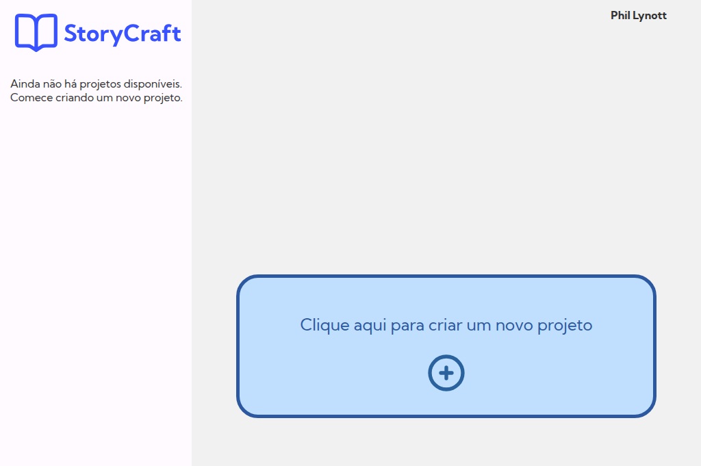
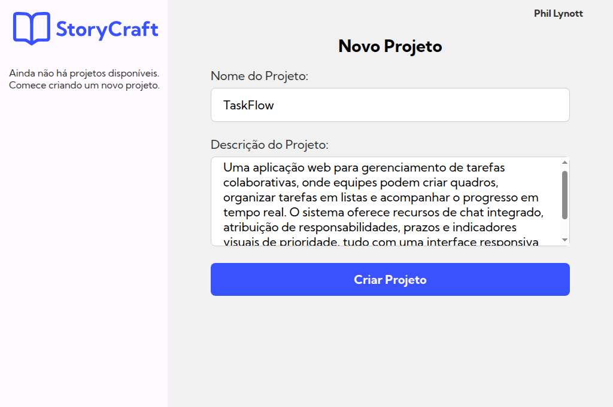
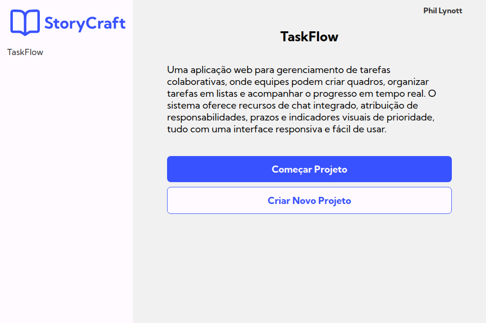
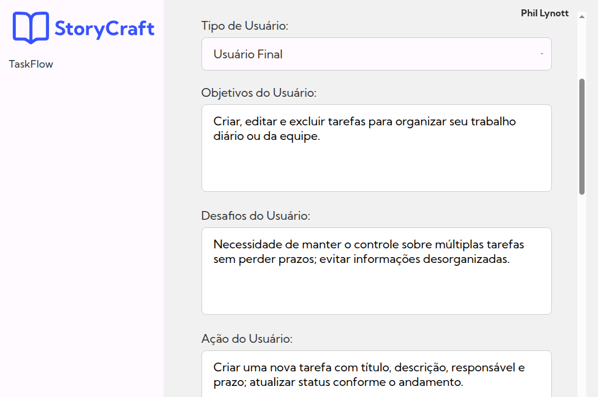
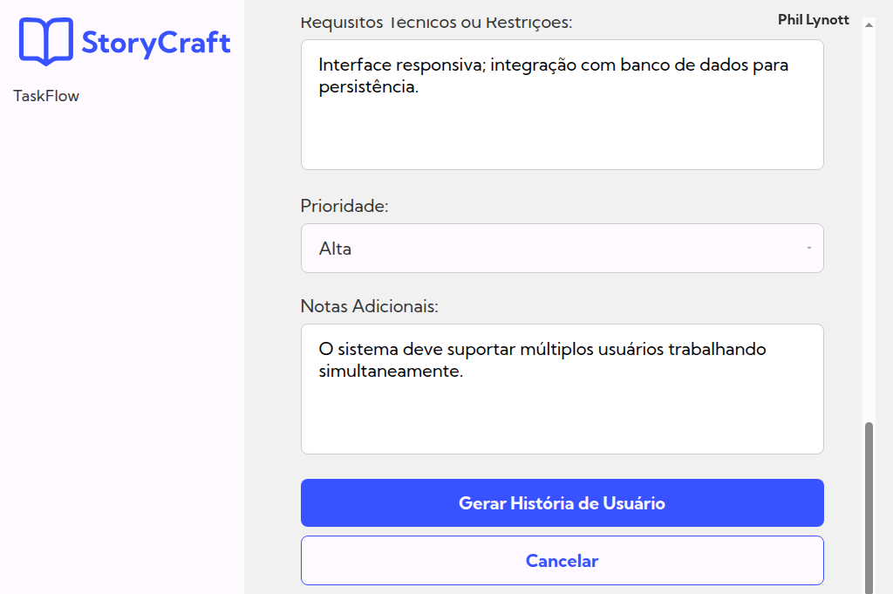
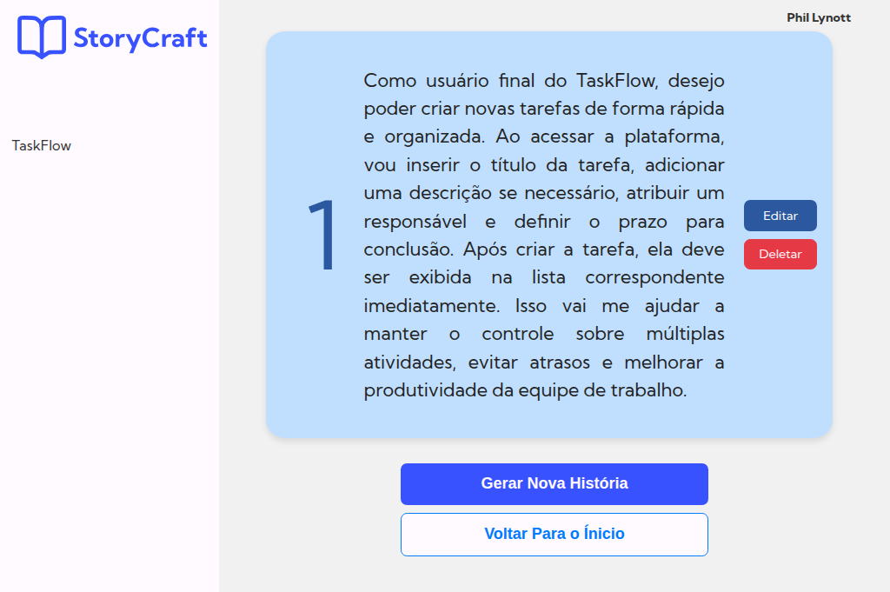
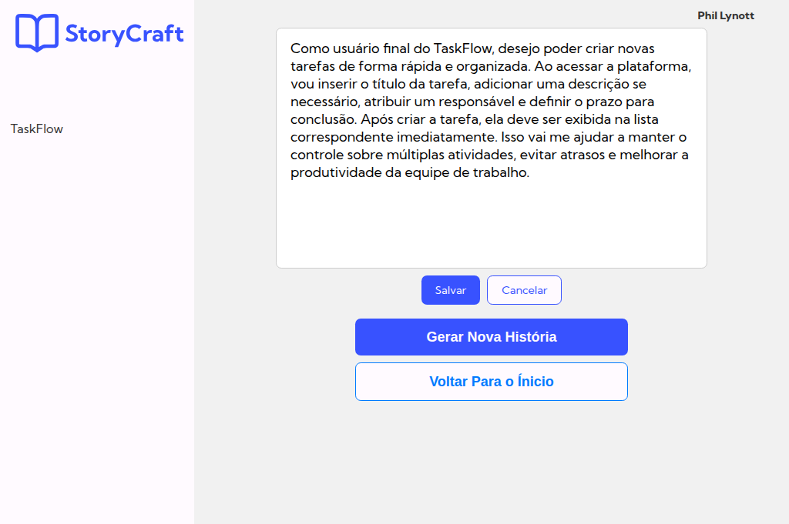
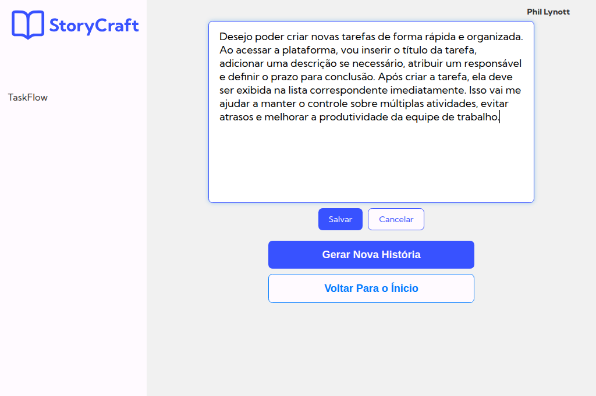
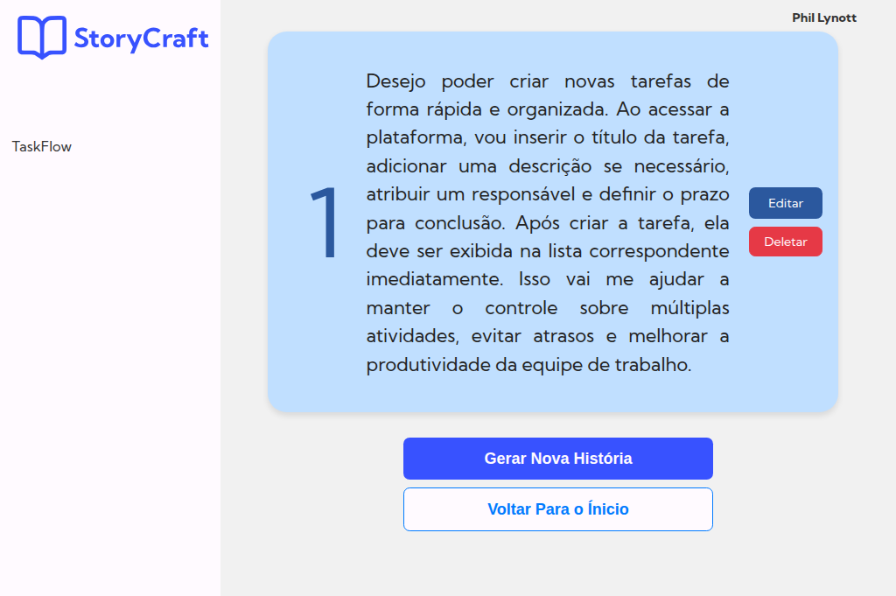

# StoryCraft – Interface para Geração de Histórias de Usuário com GPT

**StoryCraft Client** é a interface web do projeto StoryCraft, desenvolvida em React, que permite ao usuário interagir com o sistema de geração de histórias de usuário baseadas em IA generativa. Com ela, é possível criar projetos, responder a perguntas orientadas e visualizar as histórias geradas com base nas respostas.

**Se o projeto não estiver gerando as histórias, é devido à falta de créditos.**

## Acesso Online

Acesse a aplicação em: [pi-storycraft.onrender.com](https://pi-storycraft.onrender.com/)

## Funcionalidades

- Interface intuitiva para criação e gerenciamento de projetos
- Formulário para coleta de requisitos do usuário
- Visualização e edição de histórias de usuário geradas com ChatGPT
- Integração com a API do backend do PI StoryCraft
- Autenticação com JWT

## Tecnologias Utilizadas

- React.js
- JavaScript (ES6+)
- HTML5 e CSS3
- Axios
- React Router
- Bootstrap / Estilização customizada

## Como Executar Localmente

1. Clone o repositório:
   ```bash
   git clone https://github.com/seu-usuario/pi-storycraft-client.git
   cd pi-storycraft-client
   ```

2. Instale as dependências:
   ```bash
   npm install
   ```

3. Crie um arquivo `.env` com a URL do backend:

```env
REACT_APP_API_URL=http://localhost:3000
```

4. Inicie o servidor de desenvolvimento:
   ```bash
   npm start
   ```

Acesse no navegador: [http://localhost:3000](http://localhost:3000)

## Scripts Disponíveis

| Comando         | Descrição                               |
|----------------|-------------------------------------------|
| `npm start`    | Inicia o front-end em modo desenvolvimento |
| `npm run build`| Gera a versão para produção               |

## Screenshots do Projeto

> Uma visão rápida das principais telas do **StoryCraft**.

**Tela inicial (sem projetos)**



**Novo Projeto – formulário**



**Projeto criado – visão geral**



**História de Usuário – formulário**

O uso das perguntas propostas — como Tipo de Usuário, Objetivos, Desafios, Ação, Motivação, Critérios de Aceitação, Requisitos Técnicos, Prioridade e Notas Adicionais — é justificado por sua aderência a padrões reconhecidos na engenharia de software ágil. Esses elementos se baseiam em frameworks consagrados como o template Connextra (“Como [tipo de usuário], eu quero [ação], para que [objetivo]”), o princípio INVEST (Bill Wake, 2003) e o conceito dos 3-C’s de Ron Jeffries (Cartão, Conversa e Confirmação). Ao responder essas questões, garante-se que cada história seja clara, valiosa, testável e priorizável, facilitando o alinhamento entre equipe e stakeholders. Além disso, a inclusão de desafios e restrições técnicas promove maior empatia com o usuário e antecipa riscos técnicos, aumentando a eficácia e a qualidade da entrega.





**História gerada**



**Edição da história**





**História atualizada**



## Licença

Este projeto está licenciado sob a [MIT License](LICENSE).

## Colaboradores

- **Back-end:** [Luiz Lopes](https://github.com/luizlopesbr)  
- **Front-end:** [Kauan Ribeiro](https://github.com/KauanRibeiroGondim)  
- **UX/UI:** [Emmanuel Soares](https://github.com/EmmanuelSoares)  
